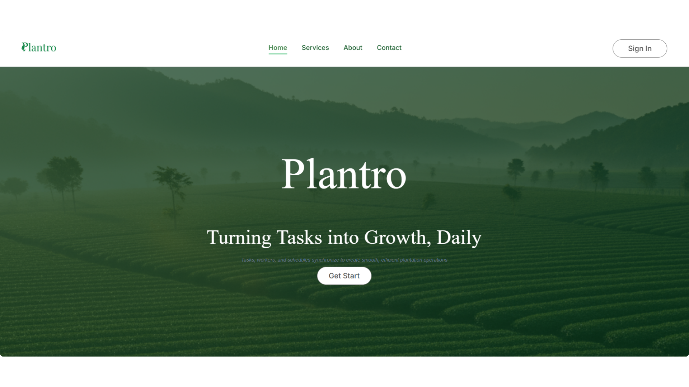
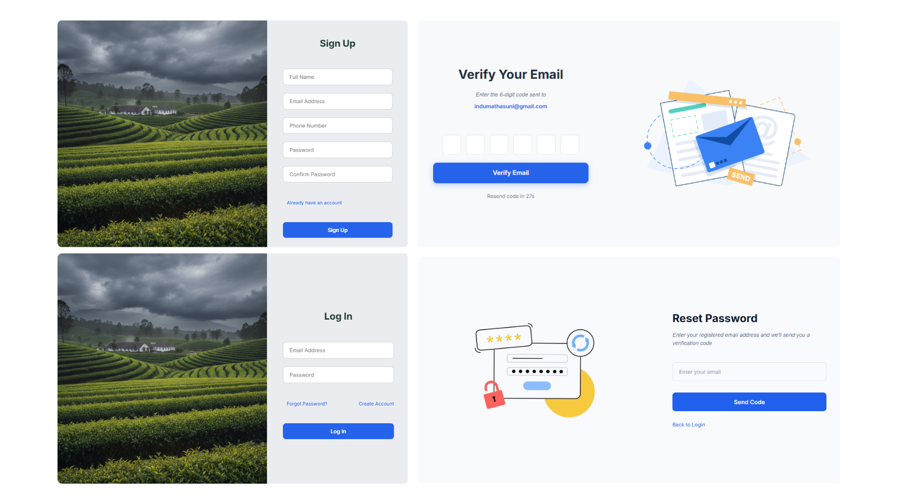
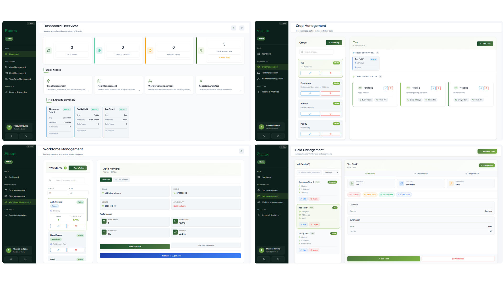
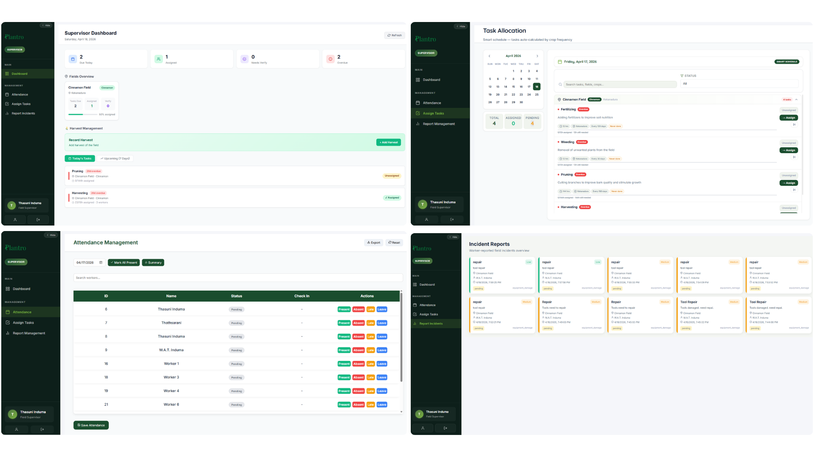
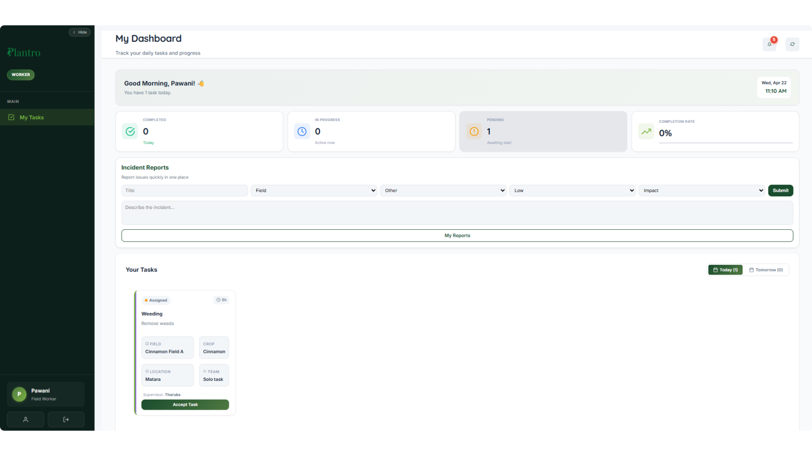
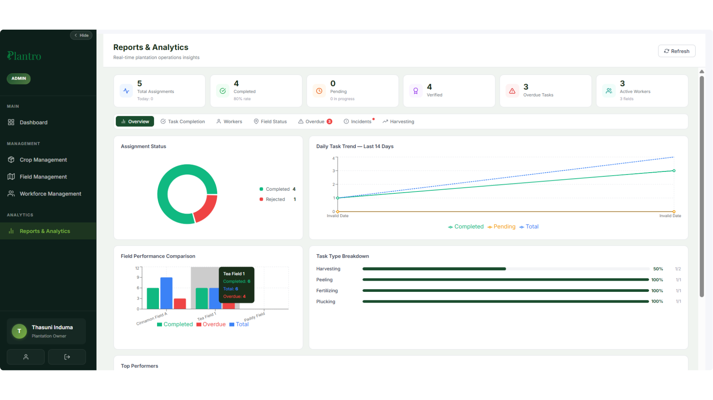

# 🍀 Plantro - Turning Tasks into Growth, Daily

> **Digitizing Plantation Operations with Efficiency, Transparency, and Real-Time Control.**
<p align="left">
  
</p>

## 🌟 Overview

**Plantro** is a full-stack **web-based plantation task and workforce management system** designed to modernize traditional agricultural operations.

It enables administrators to manage crops, fields, and workforce operations, while supervisors can efficiently assign tasks and monitor real-time progress, enhancing productivity and enabling data-driven decision-making.

---

## 🚀 Key Features

- 🌿 **Crop Management** – Manage crops like Tea, Coconut, Cinnamon, Rubber  
- 🌾 **Field Management** – Organize plantation fields efficiently  
- 👷 **Workforce Management** – Manage supervisors and field workers  
- 📋 **Task Assignment** – Assign and track daily plantation tasks  
- 📅 **Smart Scheduling** – Automated task planning based on crop type  
- 📊 **Real-Time Dashboard** – Monitor tasks and performance  
- 🌾 **Harvest Reporting** – Record daily harvest data  
- 📈 **Performance Tracking** – Analyze worker and field productivity  
- 🔔 **Notifications** – Task updates and alerts  
- 🔐 **Role-Based Access Control** – Admin, Supervisor, Worker
- 🚨 **Issue Reporting** – Report field issues to supervisors  

---

## 🧠 How It Works

1. **User Login & Role Access**  
   - Admin, Supervisor, and Worker access different system features  

2. **Field & Crop Setup**  
   - Admin defines plantation fields and crop types  

3. **Task Scheduling**  
   - Tasks are generated based on crop activities  

4. **Worker Assignment**  
   - Supervisors assign tasks to workers  

5. **Task Execution**  
   - Workers update progress and completion  

6. **Harvest Recording**  
   - Daily harvest data is recorded  

7. **Monitoring & Reports**  
   - Dashboards provide insights and performance tracking  

---

## 💻 Tech Stack

| Category | Technologies |
|----------|------------|
| **Frontend** | React.js, CSS, Bootstrap |
| **Backend** | Node.js, Express.js |
| **Database** | MySQL |
| **Deployment** | Microsoft Azure VM |
| **Tools** | Git, GitHub, Postman |

---

## 📲 Screenshots

<table>
  <tr>
    <td>
      <figure>
        
        <figcaption>Home Page</figcaption>
      </figure>
    </td>
    <td>
      <figure>
        
        <figcaption>Registration</figcaption>
      </figure>
    </td>
    <td>
      <figure>
        
        <figcaption>Admin Views</figcaption>
      </figure>
    </td>
  </tr>
  <tr>
    <td>
      <figure>
        
        <figcaption>Supervisor Views</figcaption>
      </figure>
    </td>
    <td>
      <figure>
        
        <figcaption>Worker Views</figcaption>
      </figure>
    </td>
    <td>
      <figure>
        
        <figcaption>Analytics & Reports</figcaption>
      </figure>
    </td>
  </tr>
</table>

---

## ⚙️ Installation & Setup

1. **Clone the Repository**
```bash
git clone https://github.com/ThasuniInduma/plantro_plantation_task_management_web.git

```

2. **Backend Setup**
```bash
cd backend
npm install
npm run dev
```

3. **Frontend Setup**
```bash
cd frontend
npm install
npm run dev
```

4. **Environment Variables Setup**

Backend .env
```bash
PORT=8081
DB_HOST=localhost
DB_USER=root
DB_PASSWORD=your_password
DB_NAME=plantro_db
JWT_SECRET=your_secret_key
```
Frontend .env
```bash
VITE_API_BASE_URL=http://localhost:8081/api
```

5. **Database Setup (MySQL)**
```bash
CREATE DATABASE plantro_db;
```

6. **Run the Application**
Backend
```bash
cd backend
npm run server
```
Frontend
```bash
cd frontend
npm run dev
```

7. **Open in Browser**
```bash
http://localhost:5173
```

---
Plantro modernizes traditional plantation management by introducing a structured, digital, and data-driven approach. It improves productivity, transparency, and communication between administrators, supervisors, and workers, making plantation operations more efficient and scalable.

## 🍀 Thank You for Checking Out Plantro! 🚀 Happy coding & happy growing! 🌱
